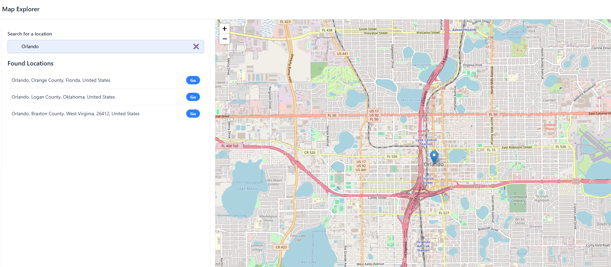

# **Map Explorer**

A mapping application integrating **OpenStreetMap API, React, TypeScript, and Context API** for modular state management.



---

## Live Demo

Explore the app live on Vercel:
🔗 [https://map-explorer-seven.vercel.app](https://map-explorer-seven.vercel.app)

---

## Description

Map Explorer is a technical demo showcasing how to interact with OpenStreetMap API using React, TypeScript, and Leaflet. It features **Context API for centralized state management**, enabling seamless data handling and improved scalability. The project allows users to search for locations and visualize them on an interactive map, making it an excellent portfolio piece for working with geospatial data.

This project is part of my portfolio to showcase **editorial clarity**, **emotionally aware UI feedback**, and **scalable architecture** using modern React tools.

---

### **Key Features**

- Search for places using OpenStreetMap’s Nominatim API
- Display a dynamic marker for selected locations
- Smooth map navigation (flyTo) upon selecting a place
- Responsive UI for better user experience

---

## Technologies Used

- **React** – Frontend library for building modular UI components
- **Context API & useReducer** – Centralized state management for scalability
- **TypeScript** – Static typing for better reliability and maintainability
- **Leaflet & react-leaflet** – Interactive mapping with OpenStreetMap integration
- **OpenStreetMap API (Nominatim)** – Location search and geocoding
- **Vite** – Fast development and optimized build process
- **TailwindCSS** – Utility-based styling for responsive and modern UI
- **ARIA Labels & Accessibility Best Practices** – Improved usability for all users

---

## **Getting Started**

### **Installation & Setup**

To run the project locally, follow these steps:

1. Clone the repository:

```bash
git clone https://github.com/maitepv87/map-explorer.git
cd map-explorer
```

2. Install dependencie:

```bash
npm install
```

Set up environment variables in a .env file:

```ini
VITE_API_URL=https://nominatim.openstreetmap.org
```

Start the development server:

```bash
npm run dev
```

Then open http://localhost:3000 in your browser.

Designed for modularity, scalability, and clarity.

## Future Enhancements

- Save favorite locations for quick access
- Enhance map styles and UI interactions
- Integrate OpenRouteService API for route navigation
